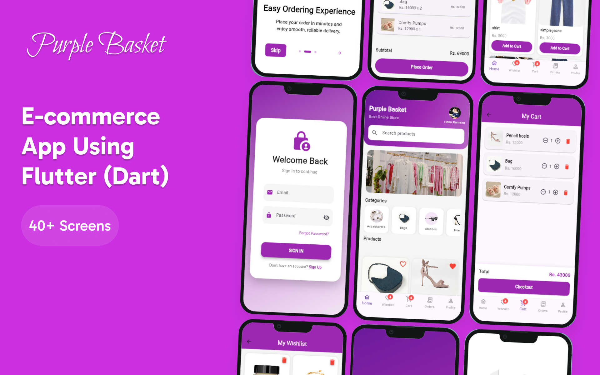

# 🛍️ Purple Basket – Flutter E-Commerce Application

<p align="center">
  
</p>

Purple Basket is a complete Flutter-based e-commerce mobile application built with Firebase.  
The app focuses on a smooth shopping experience, modern UI, and real-time data handling using Cloud Firestore.

It includes user authentication, onboarding screens, product browsing, cart & wishlist management, orders, and a role-based system for Admin and Users.

---

## ✨ App Features

### 👤 Authentication
- User Sign Up
- User Sign In
- Forgot Password
- Firebase Authentication
- Role-based access (Admin / User)

---

### 🚀 Onboarding
- Beautiful onboarding screens
- Introduction using `introduction_screen` package
- Skip & Done navigation
- First-time user experience

---

### 🛒 Shopping Features
- Product listing from Firestore
- Add products to Cart
- Add products to Wishlist
- Live Cart & Wishlist item count
- Remove items from Cart & Wishlist

---

### ❤️ Wishlist
- User-specific wishlist
- Real-time wishlist count badge
- Persistent data using Firestore

---

### 🛍️ Cart
- User-specific cart
- Live cart count badge
- Quantity handling
- Firestore-based cart storage

---

### 📦 Orders
- Place orders
- View order history
- Order listing for users
- Firestore-backed orders

---

### 🧭 Navigation
- Bottom Navigation Bar
- IndexedStack for state persistence
- Smooth screen switching
- Cart & Wishlist badge counters

---

### 👩‍💼 Admin Panel
- Admin login using role-based access
- Separate Admin Dashboard
- Add and Manage **Categories** and **Products**
- View and manage **Orders**
- Manage **Users**
- Admin-only access control ensures secure operations

---

### 🎨 UI / UX
- Modern Purple theme
- Clean & responsive layouts
- Material UI components
- Consistent typography
- Mobile-friendly design

---

## 🖼️ Assets
All images used in the app (onboarding, banners, icons) are stored in:
`assets/images/`

---

## 🛠️ Technologies Used

- **Flutter (Dart)**
- **Firebase Authentication**
- **Cloud Firestore**
- **Firebase Storage**
- **Introduction Screen**
- **Image Picker**
- **Material Design**

---

🔐 Firebase Configuration

The app uses Firebase services:

- Firebase Authentication (Email/Password)
- Cloud Firestore (User, Cart, Wishlist, Orders)

## ▶️ How to Run This Project

```
flutter pub get
flutter run
```

👩‍💻 Developer

Ramsha Ayub
Flutter Developer
Purple Basket App 💜

📌 Notes

This project is built for learning & portfolio purposes.

Backend is powered by Firebase.

UI and features can be expanded further.

Role-based system ensures secure admin access.

⭐ If you like this project, don’t forget to star the repository!